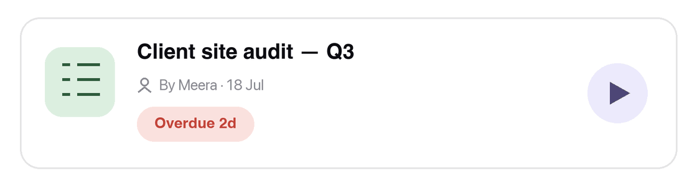
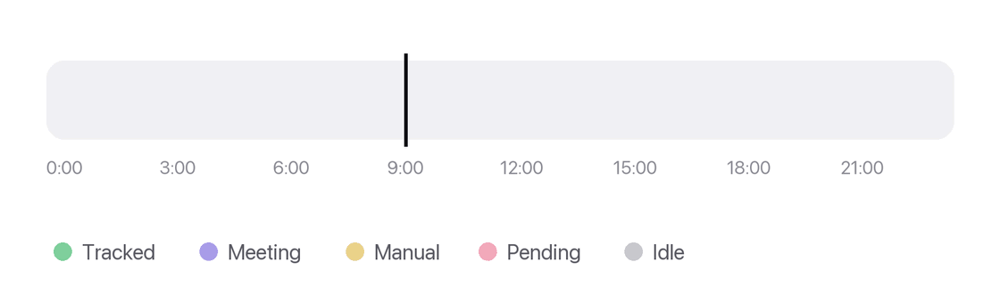
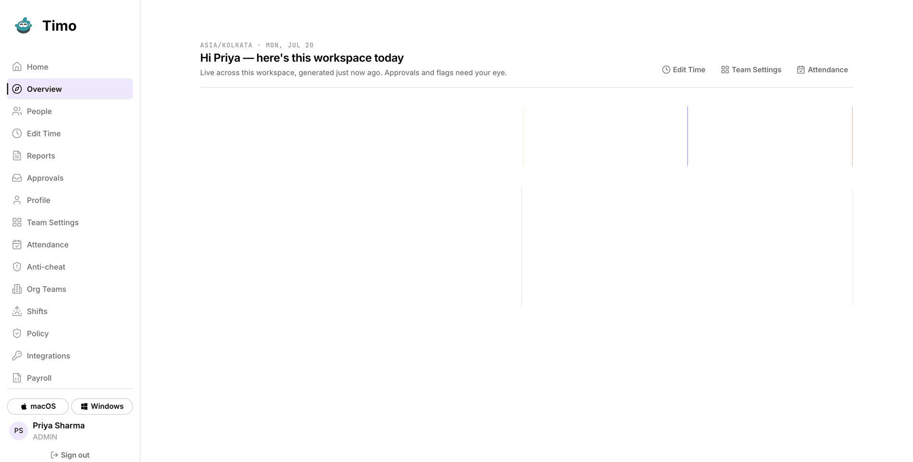
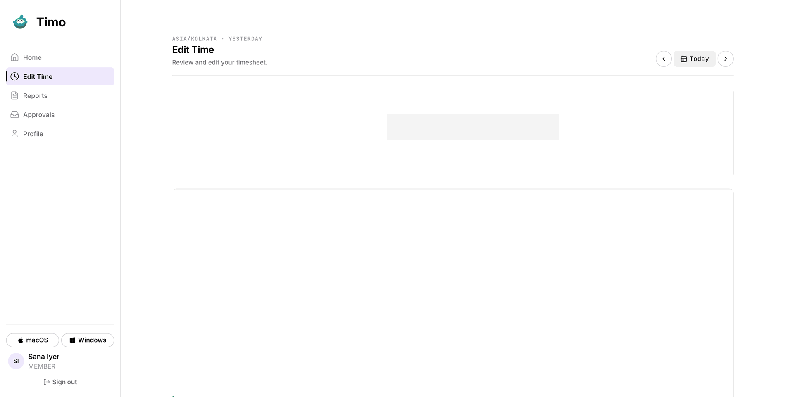
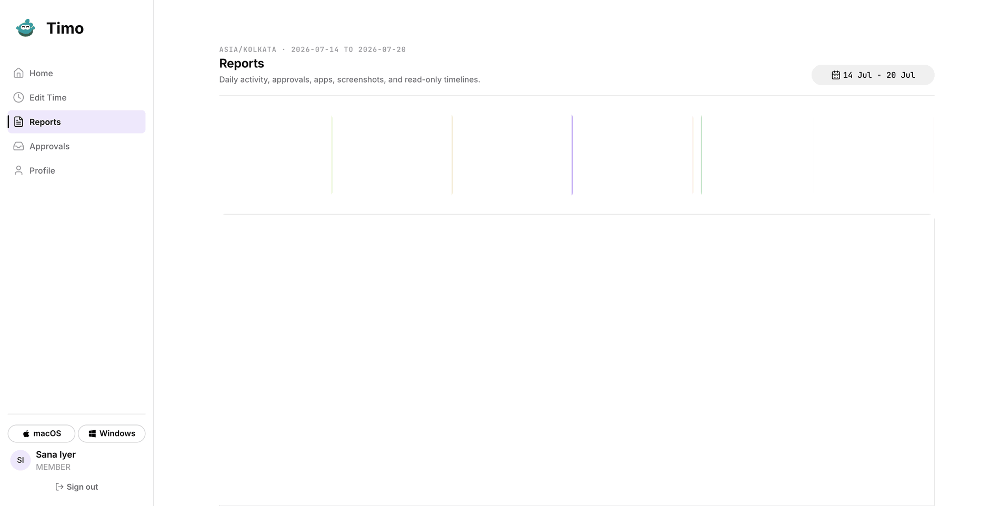

<div align="center">


# Timo

**A time tracker your team won't quietly resent.**

Real hours, honest screenshots, approvals in chat — and a privacy contract it actually keeps.

[Changelog](https://timo.emiactech.com/changelog) · [Releases](https://github.com/RelicWave-Technologies/grind/releases) · macOS + Windows

</div>

---

## Counts, never content

Most monitoring software treats "we can capture it" as "we should." Timo doesn't.

It counts **keystrokes, clicks and scroll** — the numbers, never the characters. It has no idea what you typed. No clipboard, no microphone, no camera. Window titles and URLs stay **off** unless an admin explicitly turns them on. Screenshots are visible to the person being captured and are deleted after 60 days.

And tracking **never stops silently**. If Timo isn't counting, it says so — in the menu bar, in the floating bar, and on your day. Missing time is always someone's explicit choice, never an invisible app failure.

That contract is the product. Everything below is in service of it.

---

## The desktop app


A segment-based timer that survives crashes, sleep and dead Wi-Fi. Idle time is trimmed retroactively, and the "are you still there?" minute never counts.



Start tracking against a real Lark task straight from the task list — search, press play, get on with it.



Your day as an honest ribbon: tracked work, meetings, approved manual time, idle. No fake progress rings, no invented numbers.

---

## The dashboard

Managers get the workspace at a glance. Everyone else gets their own day, minute by minute.







> Screens are captured from a seeded demo workspace. The people are fictional; the product isn't.

---

## What's in the box

| | |
|---|---|
| **Time tracking** | Segment model (work / meeting / idle-trimmed), crash-safe, auto-start on boot and wake. |
| **Zero-loss timekeeping** | Every timer move is written to disk before it reaches the screen; the server only counts minutes it can prove. A crash, a dead network or a fresh laptop can't swallow an hour you worked — and nobody can conjure one they didn't. |
| **Screenshots** | Fullscreen-safe, gentle cadence, high quality, 60-day retention, self-serve delete and blur. |
| **Activity** | Content-free keystroke/mouse/scroll counts, role-aware productivity scoring, and anti-cheat that flags for human review — it never convicts on its own. |
| **Lark integration** | Per-user OAuth, task attribution, meeting detection, and manual-time approvals decided right in chat. |
| **Dashboard** | My Day, team timesheets, activity heatmaps, attendance, reports, CSV export, teams/policy admin, and an admin-only payroll worksheet. |
| **Ships itself** | Signed and notarized on macOS; the app checks for updates after launch and installs on restart. |

---

## Stack

- **Desktop agent** — Electron 31 + TypeScript
- **API** — Express + Prisma + PostgreSQL
- **Dashboard** — React + Vite + TanStack Router/Query
- **Monorepo** — pnpm workspaces + Turborepo

```
apps/
  agent/       Electron desktop app (tracking, screenshots, activity)
  api/         Express API, Lark integration, payroll, reports
  dashboard/   React dashboard + public landing & changelog pages
  mcp/         MCP server exposing tracker data to AI tools
packages/
  core/        Shared domain logic (timer, segments, scoring)
  db/          Prisma schema + migrations
  types/       Shared contracts
```

---

## Local development

```bash
nvm use              # node 20.18
corepack enable

cp .env.example .env
#   DATABASE_URL / DIRECT_URL  → your Postgres
#   JWT_SECRET                 → openssl rand -base64 32
#   ALLOW_PASSWORD_LOGIN=true  → dev-only email/password shim (never in prod)

pnpm install
pnpm db:generate && pnpm db:migrate && pnpm db:seed
pnpm dev
```

`pnpm db:seed` prints the seeded admin credentials to sign in with. In production, Lark OAuth is the only identity — the password shim is hard-off.

**Useful scripts**

| Command | What it does |
|---|---|
| `pnpm dev` | API + Electron agent in parallel, hot reload |
| `pnpm dev:clean` | Kill stale dev processes first (stuck Electron, port 4000), then `pnpm dev` |
| `pnpm test` | Core + agent + API integration suites |
| `pnpm typecheck` / `pnpm lint` | Across every package |
| `pnpm db:migrate` / `db:seed` / `db:studio` | Prisma workflows |

> Agent tests currently assume a macOS host: the permission gate is macOS-only by design, so four tests in `trackingPermissionMonitor` / `heartbeat` fail on Linux CI runners. Tracked as a test-harness fix.

---

## Docs

- [`docs/product.md`](docs/product.md) — what we're building, for whom, and the scope guards
- [`docs/design.md`](docs/design.md) — the design system both surfaces share
- [`AGENTS.md`](AGENTS.md) — how AI coding sessions work on this repo

---

## Status & license

Timo is built for internal use at EMIAC and is in **private beta** (`0.0.2-beta.28`). The source is public for transparency and reference.

**No license is currently granted.** Without a `LICENSE` file, default copyright applies — all rights reserved. If you'd like to use, fork or contribute to Timo, please open an issue first.
